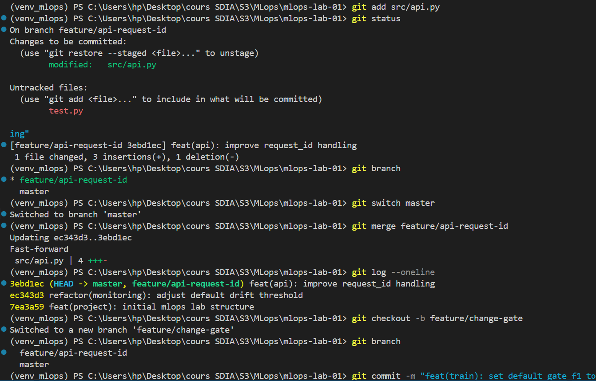
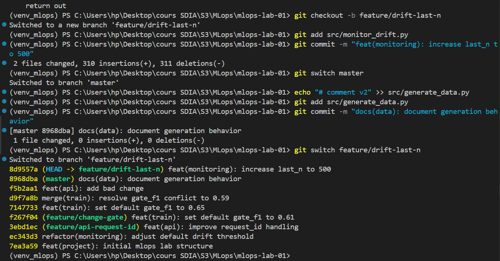
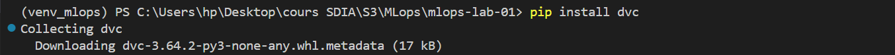

# 🧪 MLOps Lab 02 — Maîtrise de Git et workflows

Ce document présente le compte rendu complet du Lab 2, incluant les commandes Git exécutées et les captures d'écran illustratives.  

---

## Résumé des actions réalisées

- **Initialisation du dépôt Git** dans `mlops-lab-01`.
- **Premier commit** de la structure du projet (`src`, `data`, `registry`, `.gitignore`).
- **Modification et commit** du script `monitor_drift.py` pour ajuster le `z_threshold`.
- **Création d'une branche feature** `feature/api-request-id` et ajout de la gestion de `request_id`.
- **Fusion de la branche feature** dans la branche principale.
- **Création d'un conflit** sur `src/train.py` via la branche `feature/change-gate` et résolution du conflit (`gate_f1 = 0.70`).
- **Utilisation de `git stash`** pour mettre de côté et récupérer des modifications non committées sur `src/rollback.py`.
- **Tests de `git reset`** (soft, mixed, hard) sur un fichier d'expérimentation `experiments/reset_test.txt`.
- **Annulation d'un commit** avec `git revert` sur `src/api.py`.
- **Rebase d'une branche feature** `feature/drift-last-n` sur la branche principale pour intégrer de nouveaux commits.

---

## Historique des commits (extraits)

> Extraits de l'historique des commits avec détails auteur/date/message.  
> Commande utilisée : `git log --pretty=format:"%h - %an, %ad : %s" --date=short`

> 

---

## Historique graphique des commits

> Vue graphique des branches et merges.  
> Commande utilisée : `git log --oneline --graph --all --decorate`

> 

---

## Screenshots

> Captures d'écran prises pendant le lab illustrant les différentes étapes.

