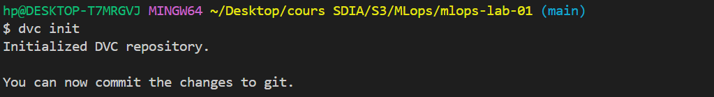
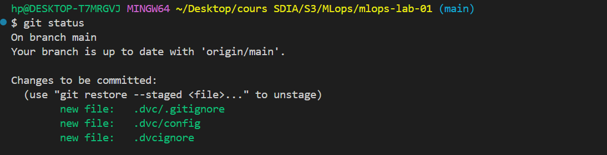
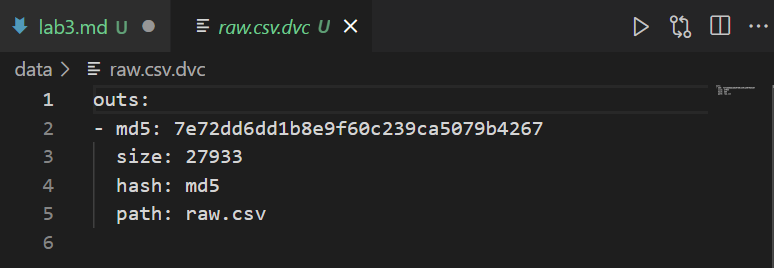
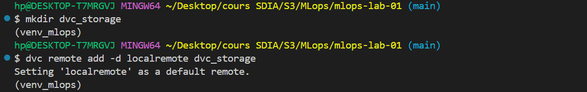
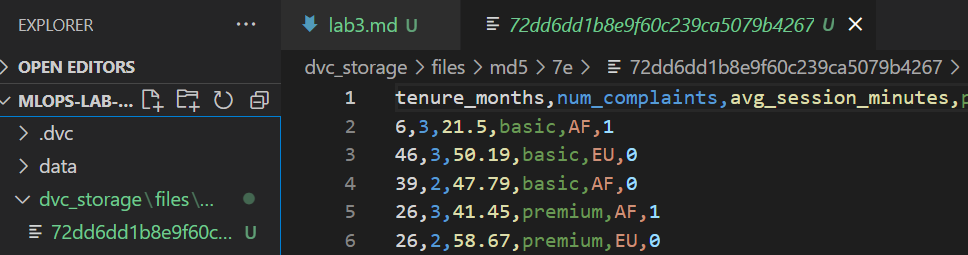
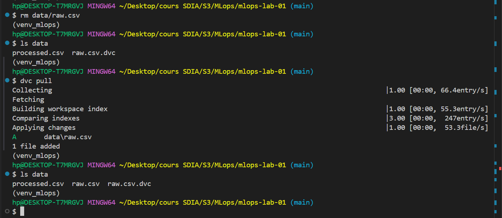
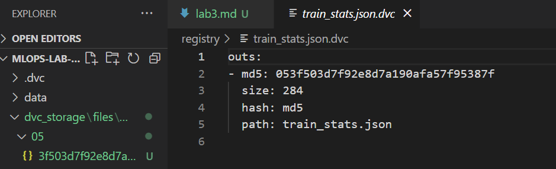
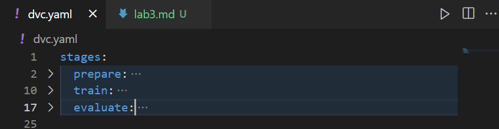
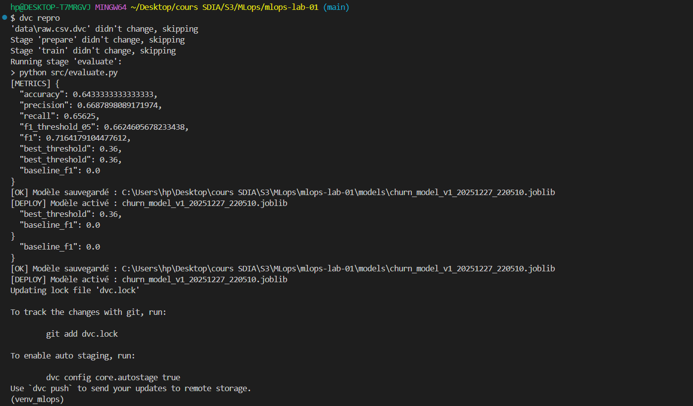

# 🧪 MLOps Lab 03 — Versionnement des données et pipelines ML avec DVC

## Objectif du lab

Ce lab a pour objectif de mettre en place un **workflow MLOps reproductible basé sur DVC**, permettant :

* le versionnement des datasets (bruts et transformés),
* la séparation claire entre code, données et modèles,
* le partage des données via un remote DVC,
* la définition d’un pipeline ML reproductible,
* la re-exécution automatique des étapes impactées.

---

## 📁 Étape 1 — Initialisation de DVC dans le projet

### Commandes exécutées

```bash
cd mlops-lab-01
dvc init
```

### Fichiers générés

* Dossier `.dvc/`
* Fichier `.dvc/config`

📸 **Screenshot – fichiers générés par dvc init**

> 
> 

### Résultat attendu

* Projet intégrant **Git + DVC**
* Infrastructure prête pour le suivi de fichiers volumineux

---

## 📦 Étape 2 — Versionnement des données brutes avec DVC

### Dataset concerné

* Fichier : `data/raw.csv`

### Ajout au suivi DVC

```bash
dvc add data/raw.csv
```

### Fichiers créés automatiquement

* `data/raw.csv.dvc`

📸 **Screenshot – fichiers .dvc**

> 

### Résultat attendu

* `raw.csv` n’est pas suivi par Git
* Seul `raw.csv.dvc` est versionné
* Git reste léger, DVC gère les données

---

## ☁️ Étape 3 — Configuration d’un remote DVC

### Création du remote local

```bash
mkdir dvc_storage
```

### Déclaration du remote par défaut

```bash
dvc remote add -d localremote dvc_storage
```

*(Alternative possible avec un cloud storage)*

```bash
# dvc remote add -d storage s3://mybucket/dvcstore
```

📸 **Screenshot – configuration du remote DVC**

> 
> 

---

## ⬆️ Étape 4 — Push des données dans le remote DVC

### Envoi des données

```bash
dvc push
```

### Vérification

* Présence de fichiers de hash dans `dvc_storage/`

📸 **Screenshot – contenu du dossier dvc_storage**

> 

### Résultat attendu

* Données stockées dans le remote
* Dataset partageable et récupérable via DVC

---

## 🔄 Étape 5 — Simulation de collaboration : suppression et récupération

### Suppression locale du dataset

```bash
rm data/raw.csv   
```

### Vérification

```bash
ls data/
```

### Récupération depuis DVC

```bash
dvc pull
```

📸 **Screenshot – récupération du dataset avec dvc pull**

> 

### Résultat

* `data/raw.csv` est restauré
* Contenu identique à l’original

---

## 📊 Étape 6 — Versionnement des données transformées

### Données concernées

* `registry/train_stats.json`

### Ajout au suivi DVC

```bash
dvc add registry/train_stats.json
```

### Versionnement Git

```bash
git add registry/train_stats.json.dvc
git commit -m "data: versioning of prepared data and statistics"
```

### Push vers le remote

```bash
dvc push
```

📸 **Screenshot – fichiers .dvc des données transformées**

> 

### Résultat

* Toutes les données nécessaires au pipeline ML sont versionnées proprement.

---

## 🔁 Étape 7 — Création d’un pipeline reproductible (dvc.yaml)

### Étape de préparation des données

```powershell
dvc stage add -n prepare `
  -d src/prepare_data.py `
  -d data/raw.csv `
  -o data/processed.csv `
  -o registry/train_stats.json `
  python src/prepare_data.py
```

### Étape d’entraînement

```powershell
dvc stage add -n train `
  -d src/train.py `
  -d data/processed.csv `
  -o models `
  python src/train.py
```

### Étape d’évaluation

```powershell
dvc stage add -n evaluate `
  -d src/evaluate.py `
  -d models/model.joblib `
  -d data/processed.csv `
  -o reports/metrics.json `
  python src/evaluate.py
```

### Versionnement du pipeline

```bash
git add dvc.yaml
git commit -m "pipeline: add prepare, train and evaluate stages"
```

📸 **Screenshot – fichier dvc.yaml généré**

> 

### Résultat attendu

DVC enregistre :

* les **dépendances**
* les **sorties**
* les **commandes**
* l’ordre du pipeline

---

## ⚙️ Étape 8 — Reproduction automatique du pipeline

### Modification du code

* Modifier `src/prepare_data.py`
  * modification mineure

### Reproduction du pipeline

```bash
dvc repro
```

📸 **Screenshot – sortie de dvc repro**

> 

### Résultat attendu

* Seules les étapes impactées sont ré-exécutées
* Reproductibilité totale du pipeline ML
* Gain de temps et traçabilité complète

---

## ✅ Conclusion

Ce lab démontre l’utilisation de **DVC comme pilier du MLOps**, permettant :

* le versionnement propre des données,
* la collaboration sans partage manuel de fichiers,
* la reproductibilité des pipelines ML,
* une intégration fluide avec Git.

Il constitue une étape clé vers des **pipelines ML industriels, traçables et maintenables**.
