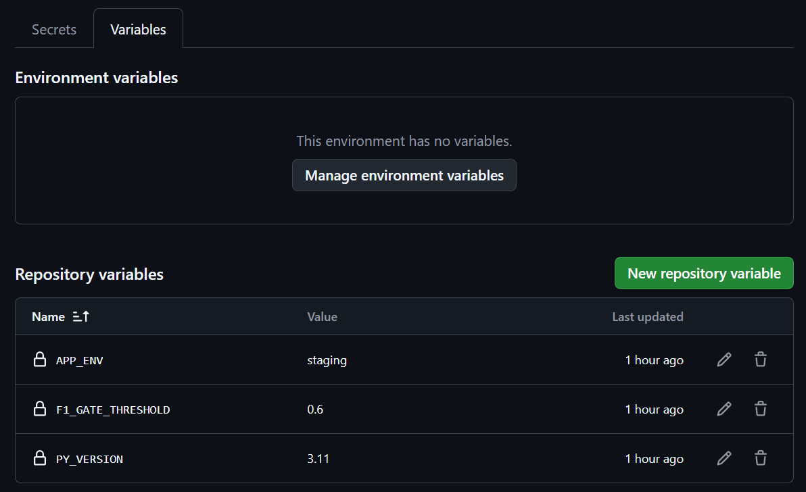
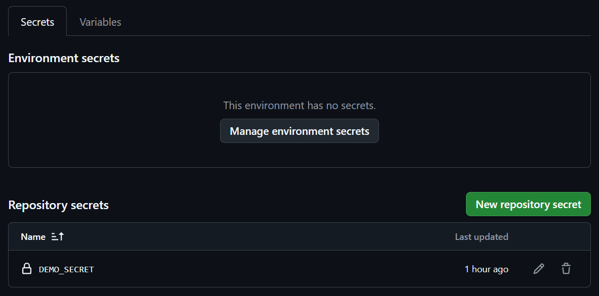
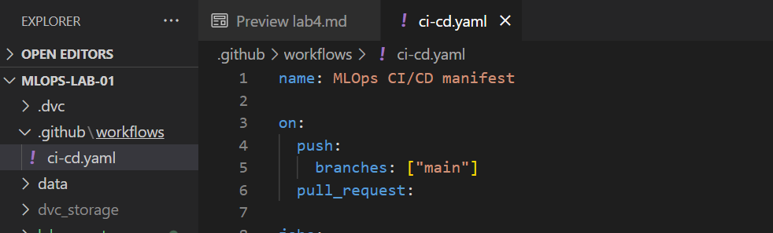
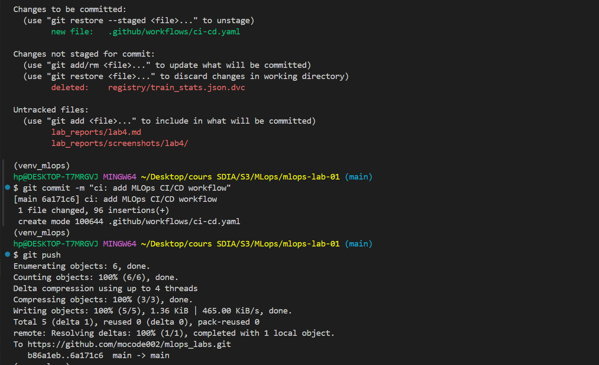
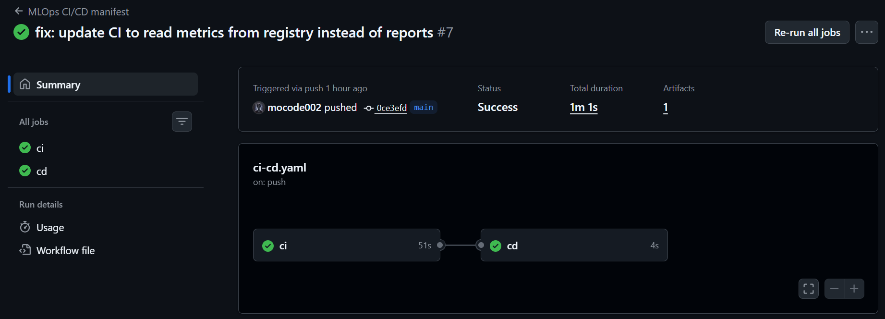

<!-- 
## Step 1

#### Variables

#### Secrets

## Step 2

#### Yaml

## Step 3

#### Commit & Push

#### Result
 -->

# 🧪 MLOps Lab 04 — Mise en place d’un pipeline CI/CD pour un projet Machine Learning

## Objectif du lab

Dans ce lab, un **pipeline CI/CD complet pour un projet Machine Learning a été implémenté et exécuté avec succès** à l’aide de **GitHub Actions**.
L’objectif était de valider automatiquement le pipeline ML, d’appliquer un **quality gate basé sur la métrique F1**, et de simuler une phase de **déploiement contrôlé**.

---

## 🔐 Étape 1 — Définition des variables et secrets GitHub

Les variables et secrets nécessaires au pipeline CI/CD ont été définis directement au niveau du repository GitHub.

### Variables configurées

* `PY_VERSION = 3.11`
* `F1_GATE_THRESHOLD = 0.60`
* `APP_ENV = staging`

### Secret configuré

* `DEMO_SECRET = "CI/CD demo secret for students"`

📸 **Screenshot – variables et secrets GitHub Actions**

#### Variables
>

#### Secrets
>

### Constat

* Les variables sont accessibles via `${{ vars.* }}`
* Le secret est protégé et accessible uniquement via `${{ secrets.* }}`
* Le repository est prêt pour une exécution sécurisée du workflow CI/CD

---

## ⚙️ Étape 2 — Création et exécution du workflow CI/CD

Un workflow GitHub Actions a été créé afin d’automatiser les phases de **CI** et **CD**.

### Fichier

* `.github/workflows/ci-cd.yaml`

### Déclencheurs configurés

* `push` sur la branche `main`
* `pull_request`

---

### 🧪 Job CI - Validation du pipeline ML

Le job **CI** a été exécuté sur un runner `ubuntu-latest`.

#### Étapes réalisées

* Récupération du code source (`checkout`)
* Installation de Python selon la version définie
* Mise en cache des dépendances pip
* Installation des dépendances ML et DVC
* Restauration du cache DVC
* Affichage du DAG du pipeline
* Génération des données brutes
* Exécution complète du pipeline ML via `dvc repro`
* Vérification automatique du **Quality Gate F1**
* Upload des artefacts ML

**Constat :**
* La métrique F1 dépasse le seuil configuré
* Le pipeline CI est validé
* Les artefacts peuvent être transmis à la phase CD

---

#### 📦 Artefacts générés

Les éléments suivants ont été automatiquement sauvegardés :

* `models/`
* `registry/`
* `reports/`

---

### 🚀 Job CD - déploiement simulé

Le job **CD** a été déclenché uniquement après la réussite du job CI et uniquement sur la branche `main`.

#### Actions réalisées

* Téléchargement des artefacts validés
* Simulation d’un déploiement via SSH
* Affichage de l’environnement cible
* Utilisation d’un secret GitHub

#### Constat
* Le job CD ne s’exécute pas si le CI échoue
* Les artefacts validés sont correctement récupérés
* Les variables et secrets sont bien injectés
* Le déploiement est contrôlé et conditionnel

---

## 🧪 Étape 3 — Vérification dans GitHub Actions

> 

Après le `commit` et le `push`, le pipeline a été observé dans l’interface GitHub Actions.

📸 **Screenshot – vue globale du workflow GitHub Actions**

> 

**Vérifications effectuées :**

* Le job **CI** installe Python, exécute le pipeline ML et applique le Quality Gate
* Le job **CD** s’exécute uniquement sur `main`
* Les artefacts sont correctement transmis entre les jobs

---

## ✅ Conclusion

Ce lab démontre la **mise en œuvre effective d’un pipeline CI/CD MLOps opérationnel**, intégrant :

* automatisation complète du pipeline ML,
* contrôle qualité basé sur des métriques,
* gestion sécurisée des variables et secrets,
* séparation claire entre CI et CD,
* simulation réaliste d’un déploiement.

Il constitue une base solide pour le **déploiement industriel de modèles de Machine Learning** avec des garanties de qualité et de traçabilité.
