# 🧪 MLOps Lab 05 — Du Notebook au Déploiement Conteneurisé d’un Modèle ML

## Objectif du lab

Ce lab a pour objectif de **passer d’un projet Machine Learning local à un déploiement conteneurisé**, en utilisant **Docker** puis **Docker Compose**, jusqu’à l’exécution de l’API churn dans un environnement reproductible.

---

## ⚙️ Étape 1 — Vérification de Docker et premier conteneur

Docker est correctement installé et fonctionnel.
Les commandes de base (`docker version`, `docker ps`, `docker run`) ont été testées avec succès.

📸 **Docker version, docker ps et lancement de Nginx**

> 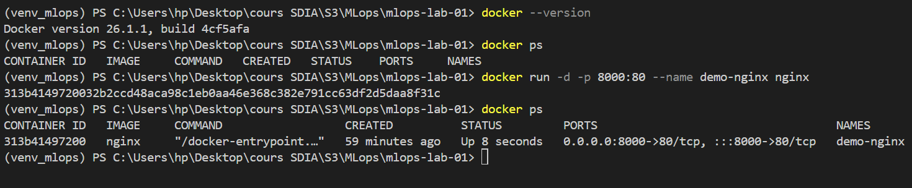

📸 **Interface web par défaut de Nginx**

> 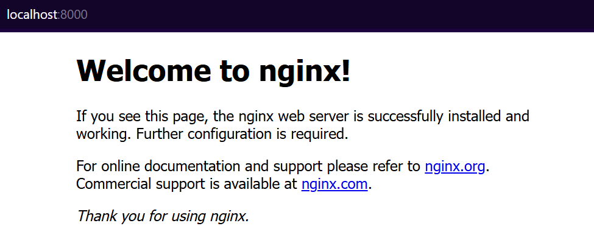

📸 **Arrêt et suppression du conteneur Nginx**

> 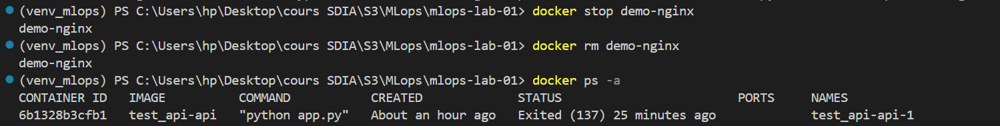

**Constat :**

* Docker fonctionne correctement
* Le mapping de ports est opérationnel
* Les conteneurs peuvent être arrêtés et supprimés sans erreur

---

## 🐧 Étape 3 — Shell Linux isolé dans un conteneur Ubuntu

Un conteneur Ubuntu interactif a été lancé afin d’exécuter des commandes Linux de base.

📸 **Commandes Linux dans le conteneur**

> 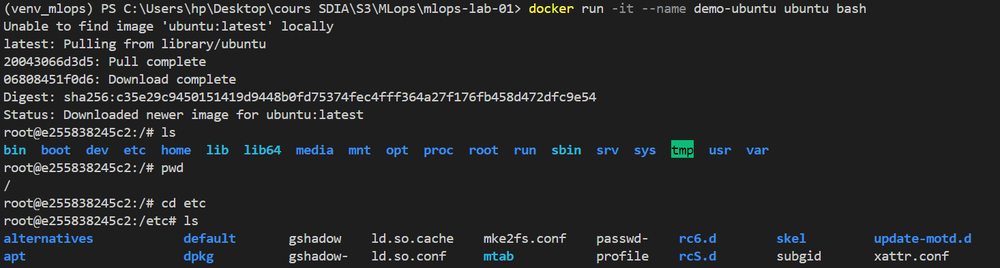

📸 **Installation d’un paquet dans le conteneur**

> 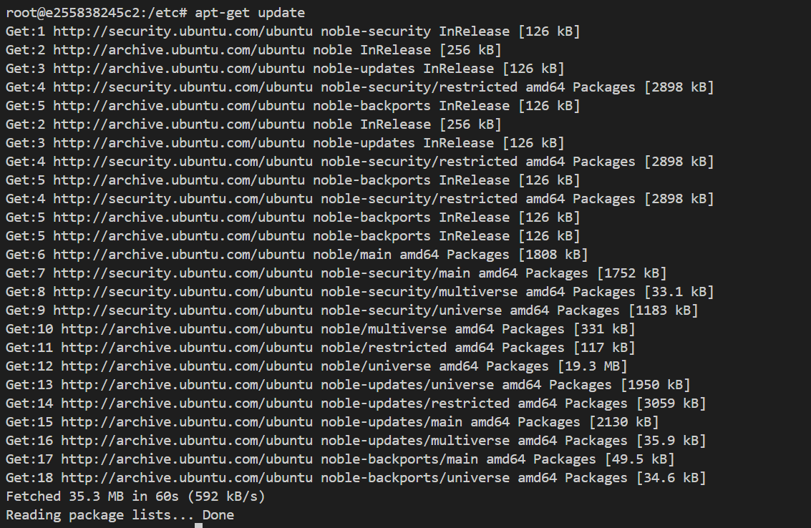

📸 **Sortie du conteneur Ubuntu**

> 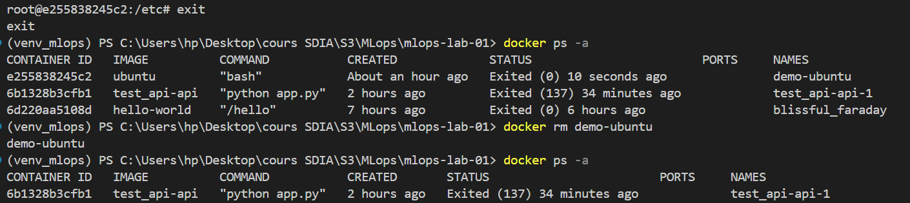

**Constat :**

* Le conteneur fournit un environnement Linux isolé
* Les paquets peuvent être installés dynamiquement
* Le conteneur persiste après arrêt

---

## 📦 Étape 5 — Vérification de l’API churn existante

L’API churn du projet **mlops-lab-01** fonctionne correctement en local avant la conteneurisation.

📸 **API churn fonctionnelle**

> 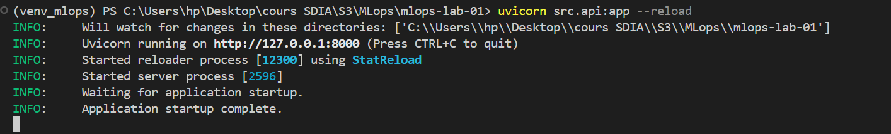

---

## 📄 Étape 6 — Création du fichier `requirements.txt`

Les dépendances nécessaires à l’API ont été listées pour permettre une installation automatique dans l’image Docker.

📸 **Fichier requirements.txt**

> 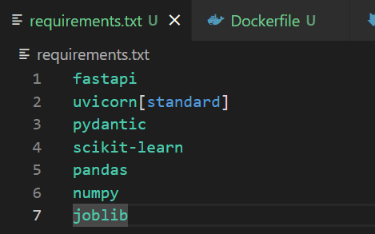

---

## 🐳 Étape 7 — Création du Dockerfile

Un `Dockerfile` a été créé pour définir l’image Docker de l’API churn.

📸 **Dockerfile de l’API churn**

> 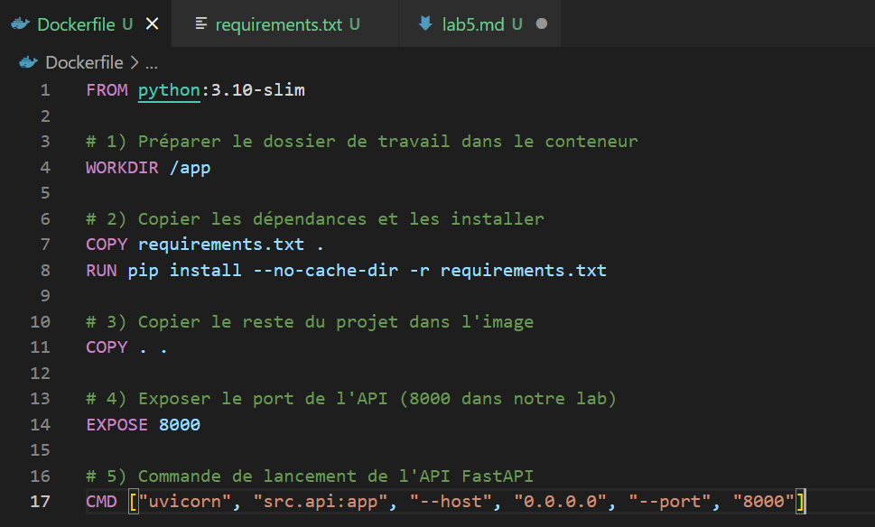

---

## 🧠 Étape 8 — Vérification du modèle actif

Un modèle entraîné est bien présent et référencé comme modèle courant dans le registry.

📸 **Modèle actif dans le registry**

> 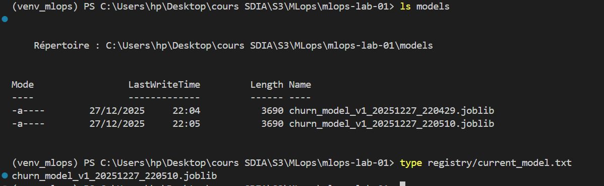

---

## 🏗️ Étape 9 — Construction de l’image Docker

L’image Docker de l’API churn a été construite avec succès.

📸 **Construction de l’image Docker**

> 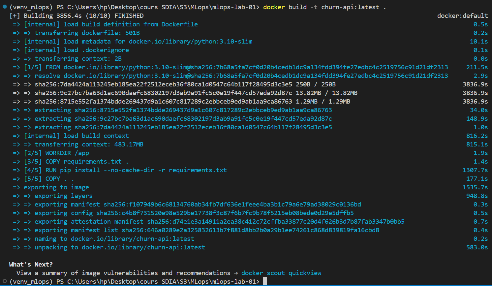

📸 **Vérification de l’image dans Docker**

> 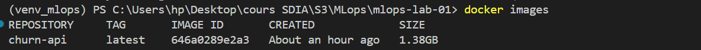

**Constat :**

* L’image `churn-api:latest` est correctement créée
* Toutes les dépendances sont intégrées dans l’image

---

## 🚀 Étape 10 — Lancement de l’API churn dans un conteneur

L’API est lancée dans un conteneur Docker et exposée sur le port 8000.

📸 **Conteneur API churn en cours d’exécution**

> 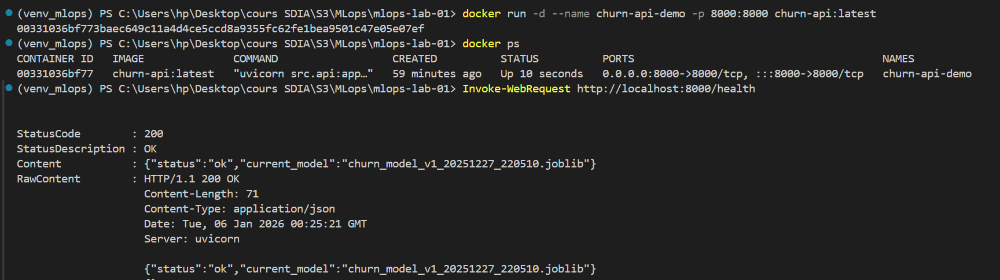

---

## 🧪 Étape 11 — Vérification des logs dans le conteneur

Les logs générés par l’API sont bien présents à l’intérieur du conteneur.

📸 **Logs de l’API churn**

> 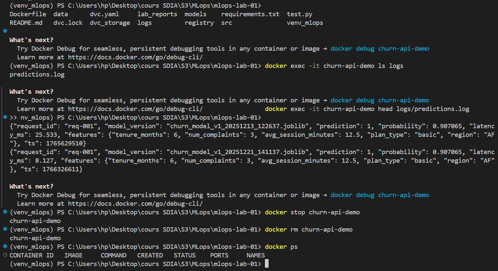

---

## 🔁 Étape 12 — Orchestration locale avec Docker Compose

Un fichier `docker-compose.yml` a été créé pour orchestrer l’API churn.

📸 **Fichier docker-compose.yml**

> 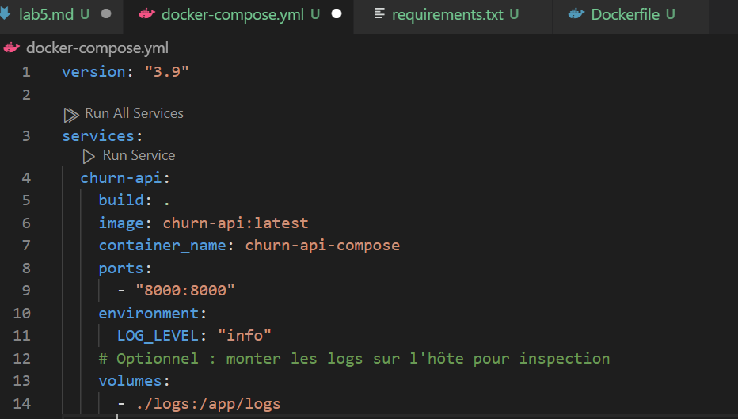

---

## ▶️ Étape 13 — Démarrage de l’API via Docker Compose

L’API est lancée à l’aide de Docker Compose.

📸 **Démarrage des services**

> 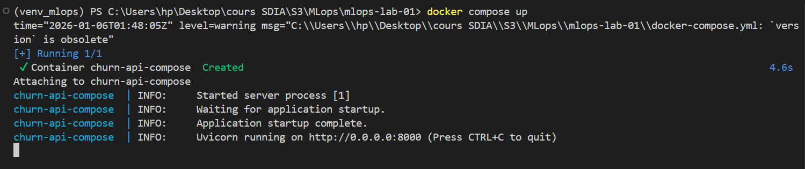

📸 **Conteneur actif via Docker Compose**

> 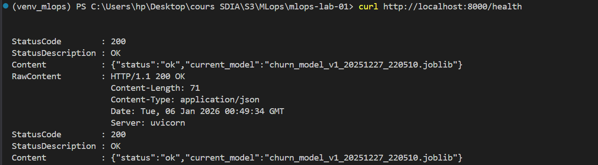

---

## 📊 Étape 14 — Observation des logs en temps réel

Les logs de l’API sont observés en temps réel pendant l’exécution.

📸 **Logs Docker Compose**

> 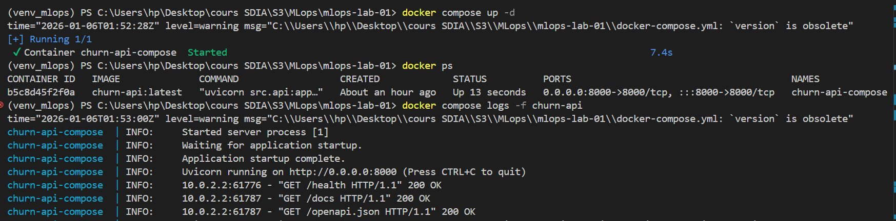

📸 **API active avec logs**

> 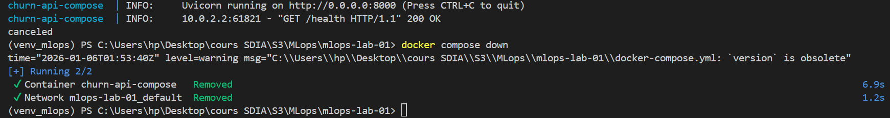

---

## ✅ Conclusion

Ce lab valide la **conteneurisation complète de l’API churn**, depuis le projet ML local jusqu’à un **déploiement reproductible avec Docker Compose**.

Il permet d’assurer :

* un environnement d’exécution isolé,
* une API facilement déployable,
* une intégration cohérente avec Git et les labs MLOps précédents.