# Lab 6 : Déploiement K8s d’un système MLOps Churn

## Étape 1 : Préparer l’environnement Kubernetes
Instructions :
Démarrer Minikube (driver Docker) :
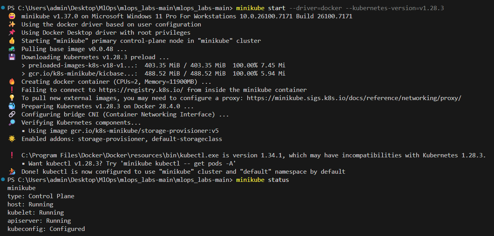

Créer un namespace dédié au lab :
Basculer le contexte courant sur ce namespace :
Vérifier :
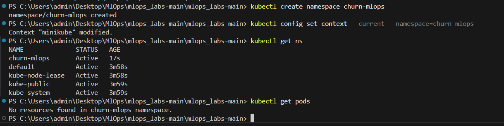

## Étape 2 : Préparer l’image Docker de l’API churn
Créer un environnement virtuel avec Python 3.12
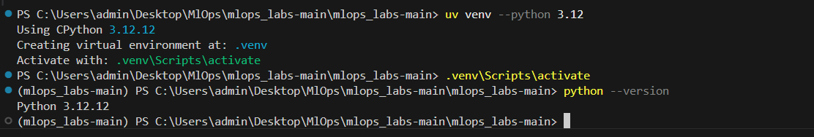

Préciser les dépendances dans requirements.txt
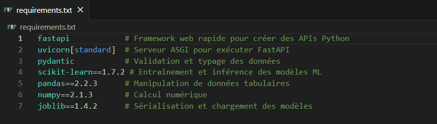
Installer les dépendances :
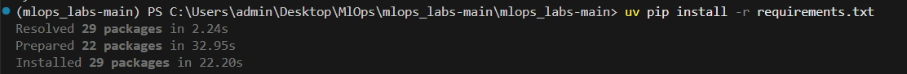

## Étape 3 : Créer le dossier des manifests Kubernetes
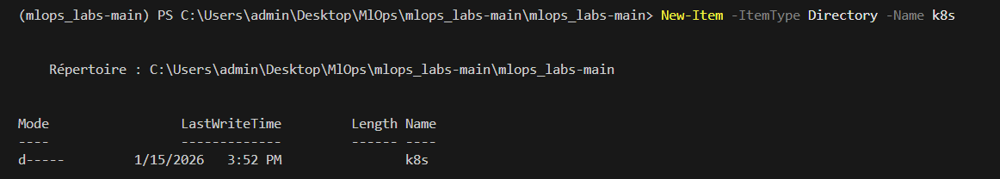

## Étape 4 : Construire l’image Docker (tag versionné)

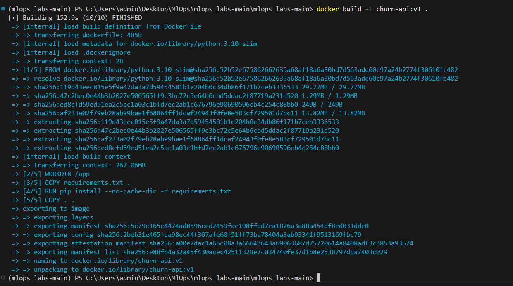

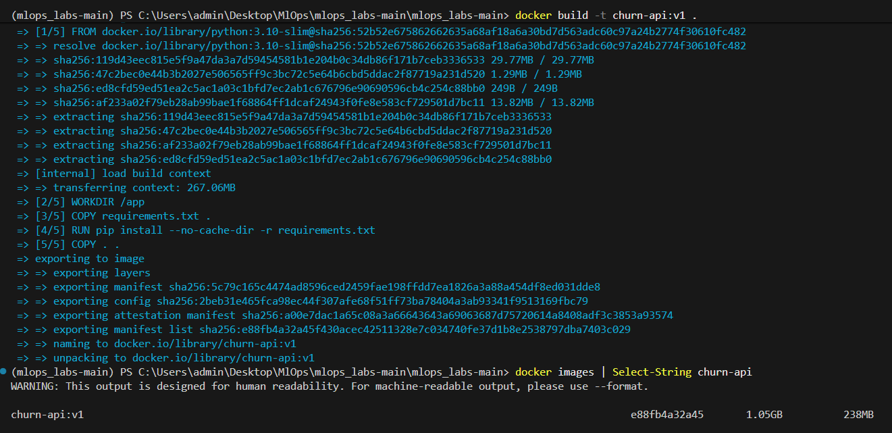

## Étape 5 : Charger explicitement l’image dans Minikube
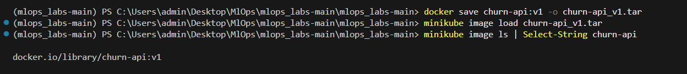

## Étape 6 : Deployment Kubernetes pour l’API churn
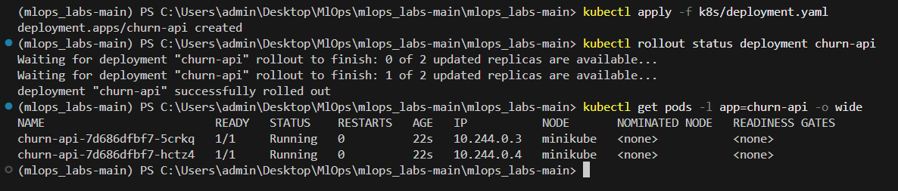

## Étape 7 : Exposer l’API via un Service NodePort
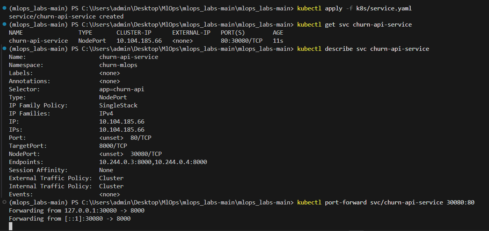

Tester l’API
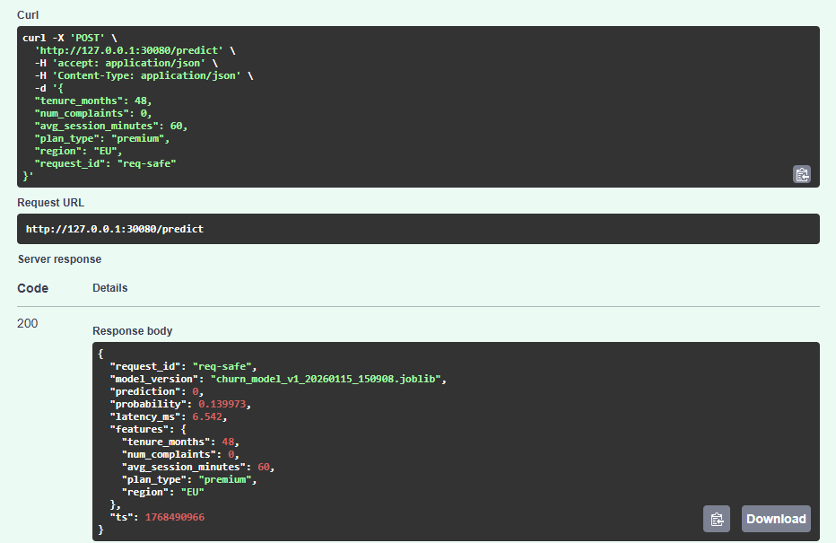

## Étape 8 : Injecter la configuration MLOps via ConfigMap
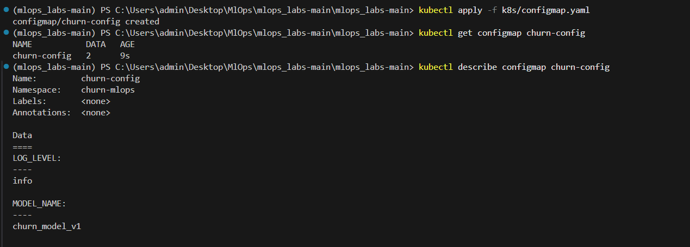

Réappliquer le Deployment :
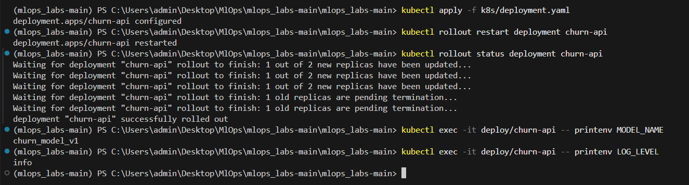

## Étape 9 : Gérer les secrets (MONITORING_TOKEN)
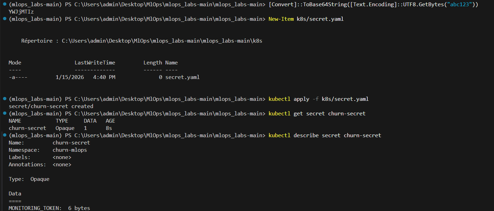

Réappliquer le Deployment :
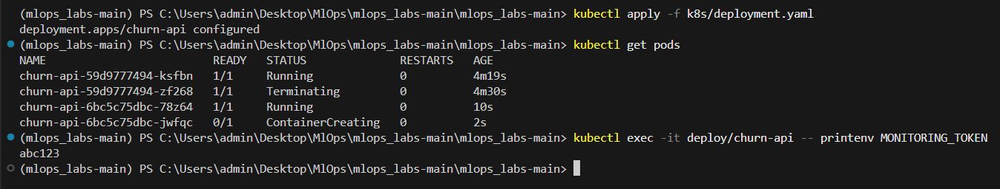

## Étape 10 : Mise en place des endpoints de santé et des probes Kubernetes pour l’API Churn
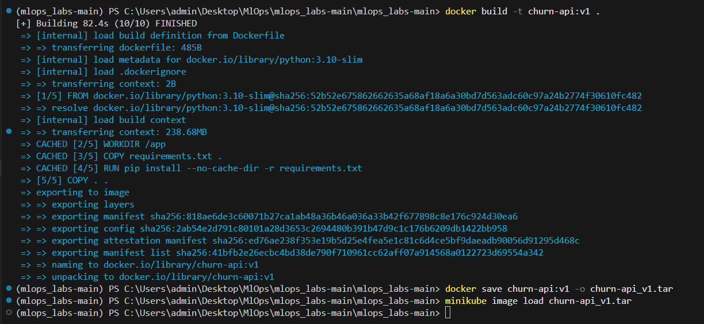

## Étape 11 : Ajouter les probes (liveness / readiness / startup)
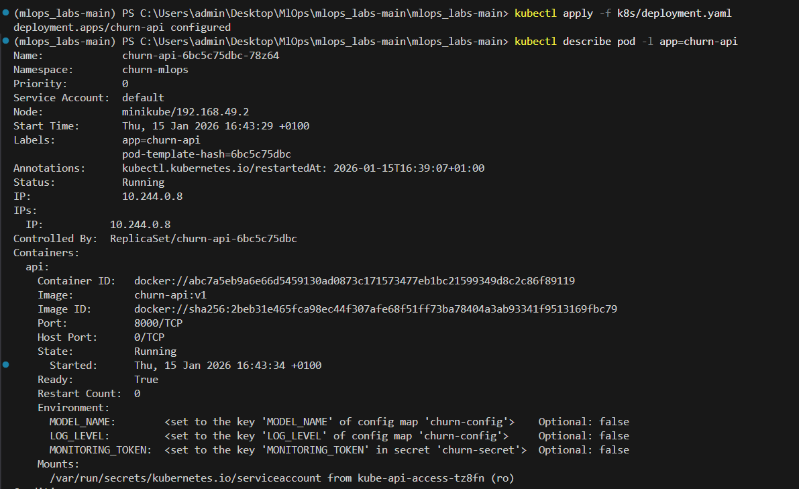
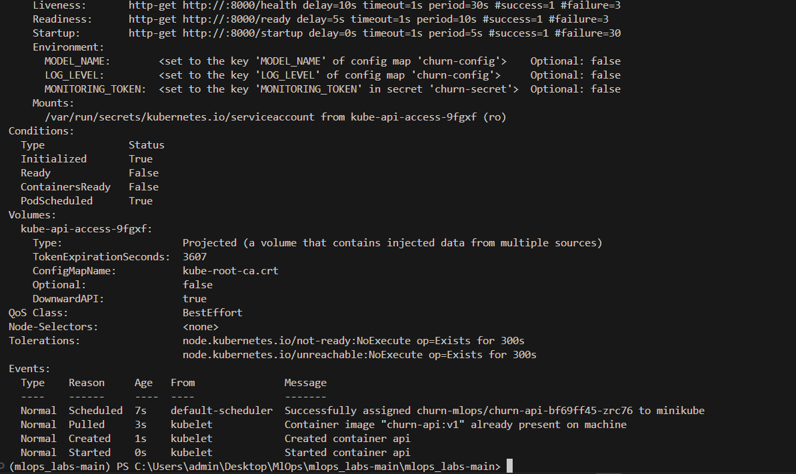

Redéployer l’application dans le cluster Kubernetes :
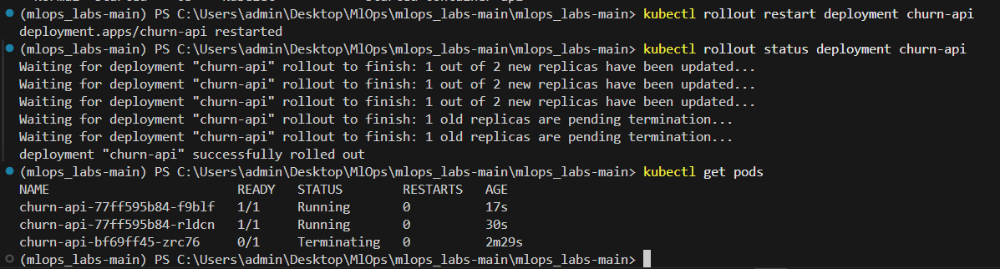

## Étape 12 : Volume persistant pour registry + logs
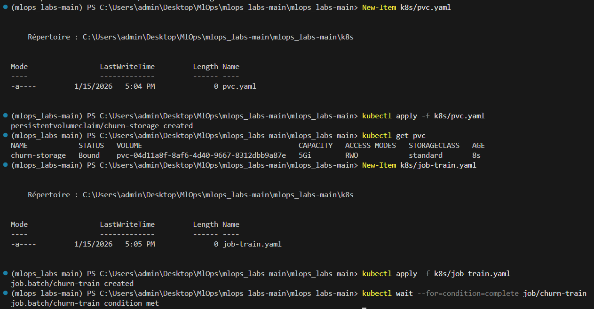

Monter le PVC dans le Deployment : l’API doit lire le modèle courant et écrire ses logs dans le même stockage persistant.
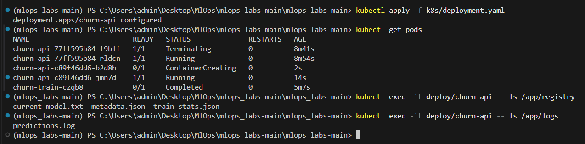

## Étape 13 : NetworkPolicy
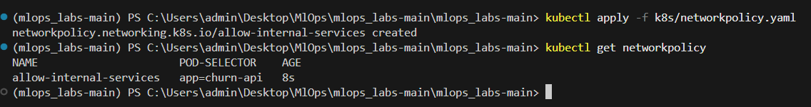

## Étape 14 : Vérifications finales

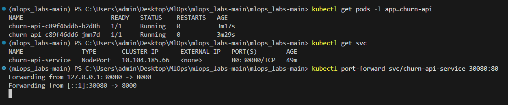

Tester l’endpoint /health :
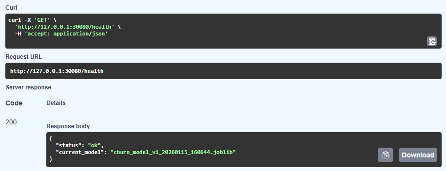

Tester l’endpoint /Predict :
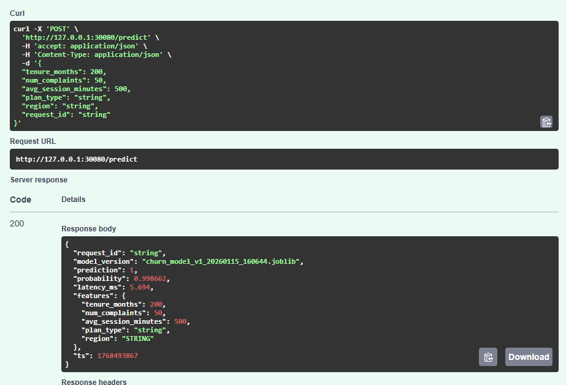

Lister les Pods pour choisir un Pod churn :
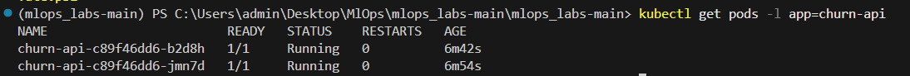

Exécuter la détection de drift dans le Pod :
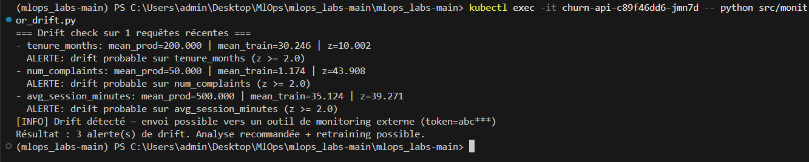

