# Lab 7 : Gestion du cycle de vie des modèles avec MLflow

## Étape 1 : Initialisation de l’environnement et installation de MLflow

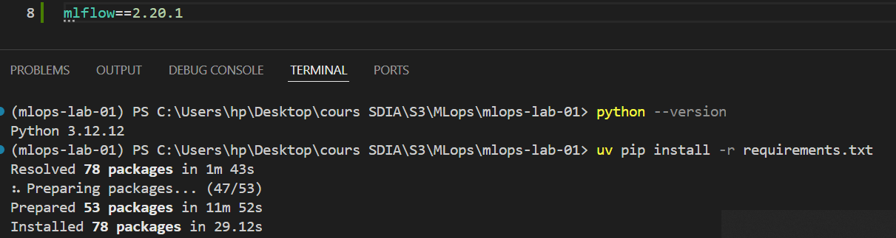

## Étape 2 : Création explicite de l’espace de stockage MLflow

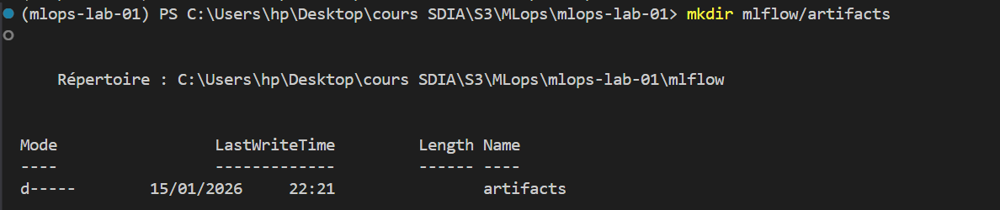

## Étape 3 : Configuration du client MLflow

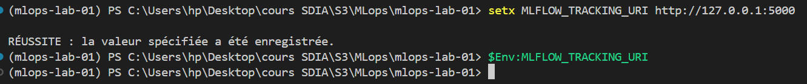

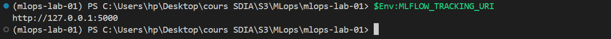

## Étape 4 : Démarrage du serveur MLflow (tracking server)

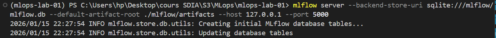

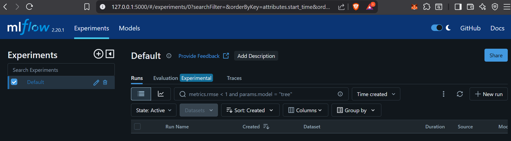

## Étape 5 : Instrumentation réelle de train.py

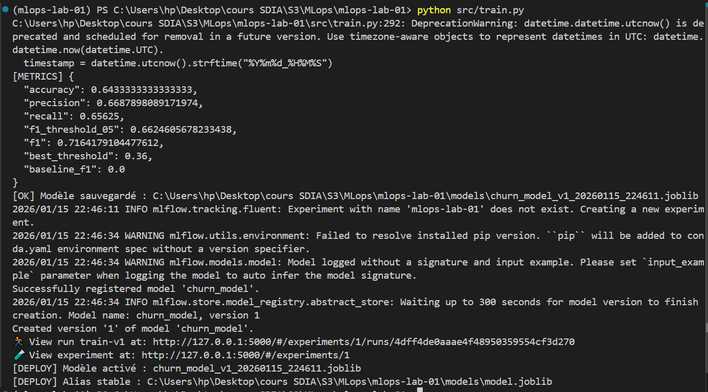

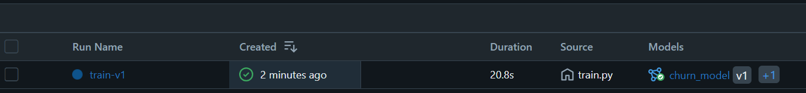

## Étape 6 : Observation du registry MLflow

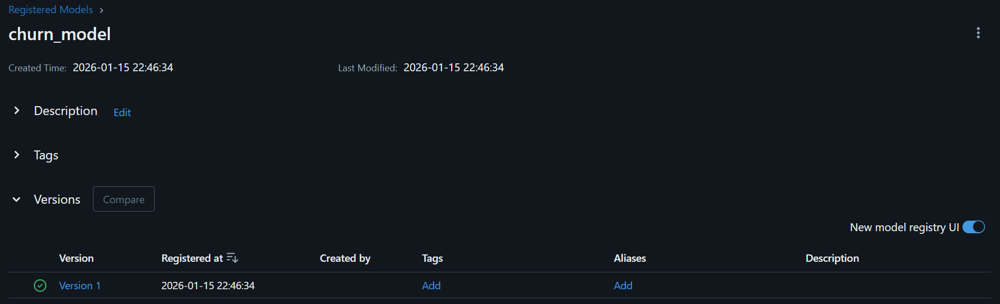

## Étape 7 : Promotion d’un modèle (activation)

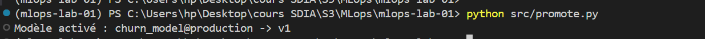

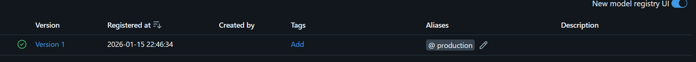

## Étape 8 : Rollback via MLflow Model Registry

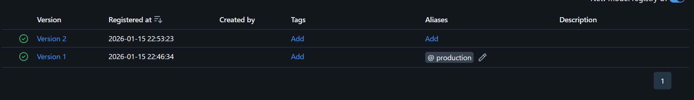

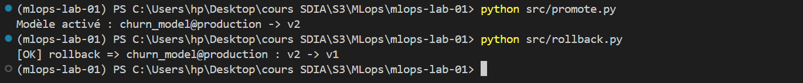

## Étape 9 : API : chargement du modèle actif

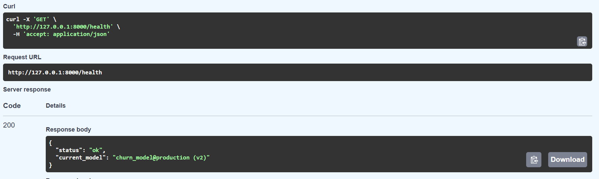